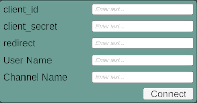

# Twitch Chat Visualization App

## Overview

This application allows users to interact with Twitch chat in unique ways by visualizing avatars, displaying images, and sending custom greetings.

## Features

- **Visualize chat users** with a command.
- **Display images** on the screen with a chat command.
- **Greet users** through custom greetings.
- **Avatar-based interactions**, including attacks between user avatars.

## Commands (Case Insensitive)

### Visualize a Chat User:
- `'_i_name'` - Displays the avatar of a user, where `'name'` is the avatar name.
    - Avatar name corresponds to the folder name in `StreamingAssets/Graphics/Avatars/`.
    - Example: If a folder named `SuperMan` exists, entering `_i_superman` in chat will display the avatar with the nickname of the chat user who entered the command.

### Display an Image:
- `'_name'` - Displays an image at the center of the screen, where `'name'` is the image name.
    - Image name corresponds to the folder name in `StreamingAssets/Graphics/Images/`.
    - Example: If a folder named `SuperMan` exists, entering `_superman` in chat will display the image.
    - The folder can also contain a `.txt` file listing additional commands for the image.

### User Greetings:
- Users can greet others with commands like:
> hello|hi|hey|good\s(morning|afternoon|evening)|ку|драсте|драсти|дратути|дратуте|дароу|привет(ы)|халоу|драсть|драсьте|здарова|сдарова|привет|здравствуй(те)?|добрый\s(день|утро|вечер)
- Each user can greet only once until the next application restart.

### Attack:
- `_attack @userName` - Allows a user's avatar to attack another user's avatar if both have avatars set up.

## Adding Custom Avatars

Users can add custom avatar sprites to the directory: `StreamingAssets/Graphics/Avatars/`.
- The folder name becomes the avatar's name.
- Up to four subfolders can be added inside each avatar's folder:
- `left`, `right`, `attack`, `idle` - Each folder should contain the respective avatar sprites.

### Subfolder Behavior:
- **`idle`**: Allows the avatar to move around the screen with small pauses.
- **`left`**: Animation for the avatar moving left. If `right` is not present, the application will generate a mirrored animation.
- **`right`**: Animation for the avatar moving right. If `left` is not present, the application will generate a mirrored animation.
- **`attack`**: Animation for the avatar's attack.

> **Note:**
> - If the `attack` folder exists, both `left` and `right` cannot exist together.
> - If the `attack` folder does not exist, `left` and `right` can be used as separate animations for movement.

### Folder Variations:
- `idle`
- `left`
- `right`
- `idle`, `left`
- `idle`, `right`
- `left`, `attack`
- `right`, `attack`
- `left`, `right`
- `idle`, `left`, `attack`
- `idle`, `right`, `attack`
---
## Connecting the Application to Twitch via Two-Factor Authentication

1. Go to [Twitch Developer Console](https://dev.twitch.tv/console).
2. Register a new application:
- Fill out the following fields:
    - Application Name
    - OAuth Redirect URL: Use `http://localhost` or `http://localhost:8080`
    - Category: Game Integration
    - Client Type: Confidential
- Click "Create".

3. Your application will now have a Client ID and a Secret Key, which are required for authentication.

4. Fill in the fields in the application with the obtained data.

- The secret key is required once the authorization token expires (approximately every 4 hours).
- You will need to re-enter the secret key into the application.
- The secret key is provided by Twitch upon request and is shown only once in the application management on Twitch.
- If you forget the secret key, you can generate a new one in Twitch's application management, but you will need to re-enter all fields in the application.

---

## Integration with OBS

1. Create new Game Capture
2. Mode: Capture specific window
3. Window: [TwitchAvatars.exe]
4. ✅ **Allow transparency**

---