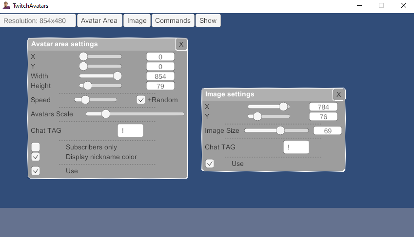
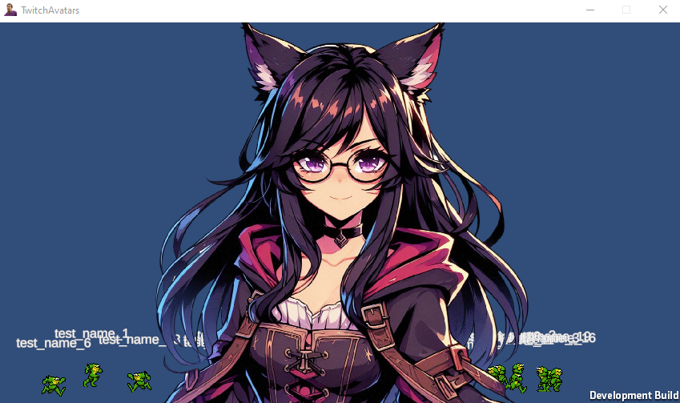

# Twitch Chat Avatar Visualizer

**IMPORTANT:** The Twitch platform requires token reauthorization every 4 hours. You will need to re-enter your Twitch secret key when prompted. A browser window with a reauthorization code will open to facilitate token renewal — **make sure this browser window does not appear on your stream!**

## About the Application

This application allows you to integrate avatars, images, and visual greetings directly from the Twitch chat. Users can display their avatars, call images, and send greetings, all controlled through chat commands.

### Key Features:
- **Display user avatars.**
- **Show images on the screen.**
- **Visualize greetings from chat.**

## Adding Avatars and Images

### Images
To add an image:
1. Place a `.png` file in `\TwitchAvatars_Data\StreamingAssets\Graphics\Images\`.
2. Create a folder named after the image, then place the image inside.
3. To call the image from chat, use the command: `TAGimageName`, where:
  - **TAG** — the chat tag set for images.
  - **imageName** — the folder name (case-insensitive).

### Avatars
To add an avatar:
1. Place the avatar files in `\TwitchAvatars_Data\StreamingAssets\Graphics\Avatars\`.
2. Create a folder for the avatar name, and if available, add subfolders for animation states:
- **`idle`**: Allows the avatar to move around the screen with small pauses.
- **`left`**: Animation for the avatar moving left. If `right` is not present, the application will generate a mirrored animation.
- **`right`**: Animation for the avatar moving right. If `left` is not present, the application will generate a mirrored animation.
- **`attack`**: Animation for the avatar's attack.
#### Subfolder Behavior:

> **Note:**
> - If the `attack` folder exists, both `left` and `right` cannot exist together.
> - If the `attack` folder does not exist, `left` and `right` can be used as separate animations for movement.

#### Folder Variations:
- `idle`
- `left`
- `right`
- `idle`, `left`
- `idle`, `right`
- `left`, `attack`
- `right`, `attack`
- `left`, `right`
- `idle`, `left`, `attack`
- `idle`, `right`, `attack`

3. To call or change an avatar from chat, use the command: `TAGavatarName`, where:
  - **TAG** — the chat tag set for avatars.
  - **avatarName** — the folder name (case-insensitive).

### User Greetings:
- Users can greet others with commands like:
> hello|hi|hey|good\s(morning|afternoon|evening)|ку|драсте|драсти|дратути|дратуте|дароу|привет(ы)|халоу|драсть|драсьте|здарова|сдарова|привет|здравствуй(те)?|добрый\s(день|утро|вечер)
- Each user can greet only once until the next application restart.

## Main Menu

- **Resolution** — select the window size that best fits your stream.
- **Avatar Area** — configure the avatar display area.
- **Image** — adjust image display settings.
- **Commands** — show available chat commands.
- **Show/Hide** — toggle UI visibility (for testing).

## Settings

### Avatar Display
- **X, Y, Width, Height** — position and dimensions of the avatar movement area.
- **Speed** — base speed of avatar movement.
- **✅Random** — random variation added to the base speed of each avatar.
- **Avatars Scale** — adjust avatar scale on the screen.
- **Chat TAG** — tag for calling or changing avatars in chat.
- **✅Subscribes Only** — restrict commands to subscribers only.
- **✅Displayed Nickname Color** — show chat nickname color.
- **✅Use** — enable display on stream.

### Image Display
- **X, Y, Size** — position and size of the displayed image.
- **Chat TAG** — tag for calling images in chat.
- **✅Use** — enable display on stream.

---
## Connecting the Application to Twitch via Two-Factor Authentication

1. Go to [Twitch Developer Console](https://dev.twitch.tv/console).
2. Register a new application:
- Fill out the following fields:
  - Application Name
  - OAuth Redirect URL: Use `http://localhost` or `http://localhost:8080`
  - Category: Game Integration
  - Client Type: Confidential
- Click "Create".

3. Your application will now have a Client ID and a Secret Key, which are required for authentication.

4. Fill in the fields in the application with the obtained data.

- The secret key is required once the authorization token expires (approximately every 4 hours).
- You will need to re-enter the secret key into the application.
- The secret key is provided by Twitch upon request and is shown only once in the application management on Twitch.
- If you forget the secret key, you can generate a new one in Twitch's application management, but you will need to re-enter all fields in the application.

---

## Integration with OBS

1. Create new Game Capture
2. Mode: Capture specific window
3. Window: [TwitchAvatars.exe]
4. ✅ **Allow transparency**

---

## Stream Convenience Features

The application automatically hides UI elements when focus is lost, ensuring a clean display for streaming. You can also minimize the application to save screen space while maintaining chat functionality and visual display.

--- 

---

Enjoy adding real-time interactivity to your Twitch stream!

